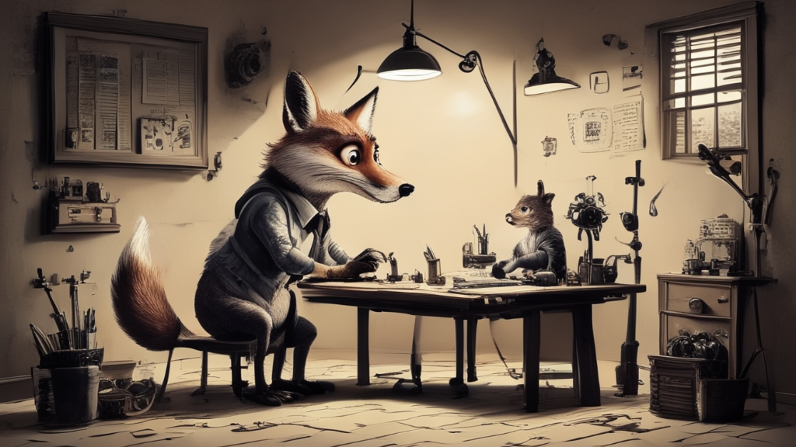
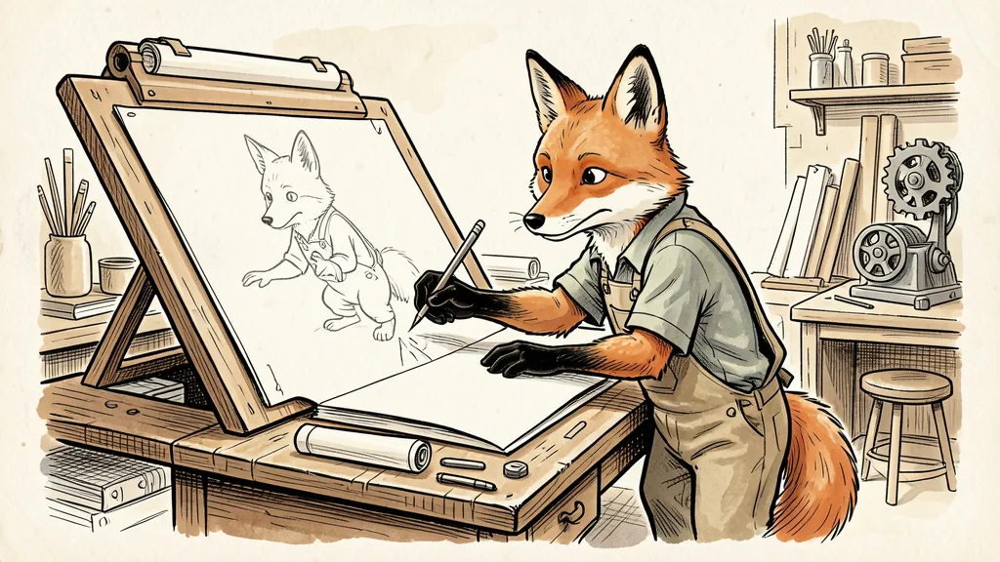
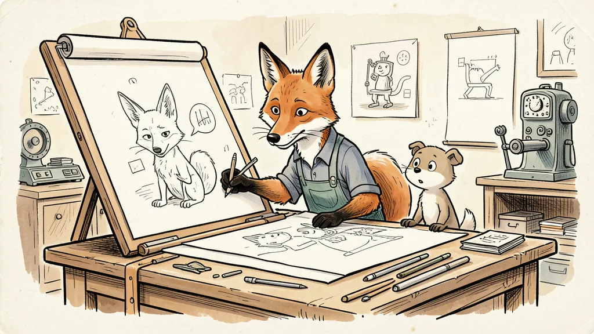
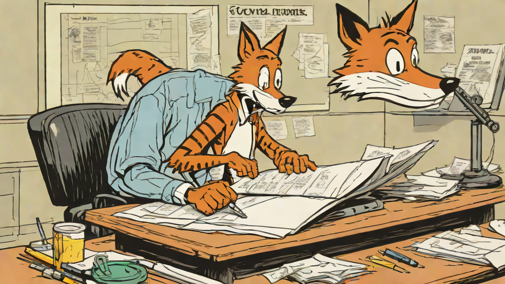
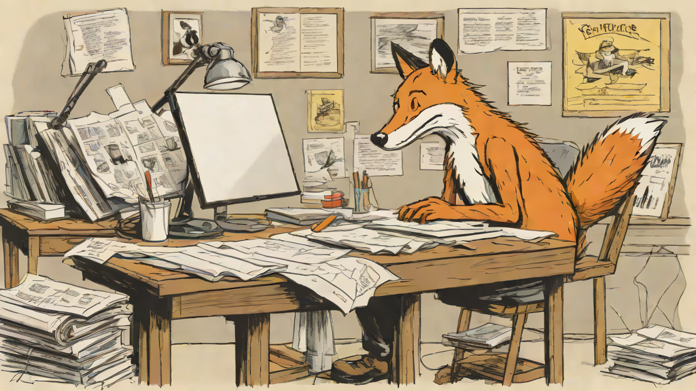
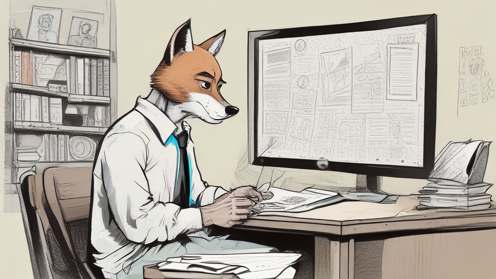
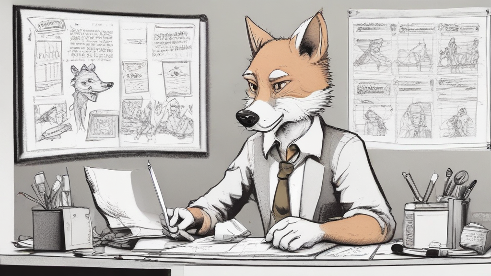
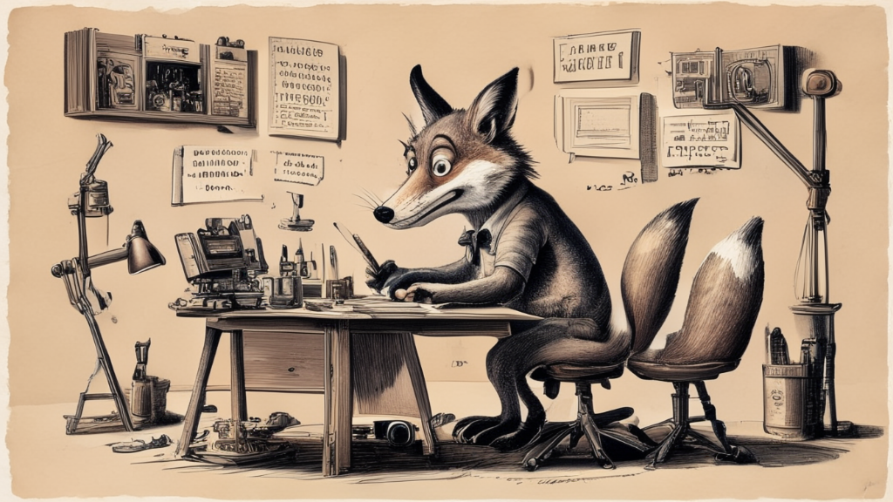

# Contexte

## A la recherche d'une identité visuelle

Alors que j'écrivais le premier billet de ce blog, je me suis dit qu'il me fallait des images pour illustrer le contenu et rendre la lecture plus agréable. Comme nous sommes à l'ère de l'IA générative, plus besoin de passer des heures sur [Pixabay](https://pixabay.com/) (ou autre site d'images libres de droit) à la recherche de l'image parfaite : ces nouveaux modèles permettent de créer des images photoréalistes sur commande (ou plutôt sur "prompt"). Dans mon cas, ce qui m'intéressait particulièrement était de pouvoir créer une _identité visuelle_, en gardant une constance / cohérence dans les illustrations de mon blog.

Pour changer des éternelles images sur l'IA type science fiction avec des faisceaux de lumières sur fond noir, j'ai voulu prendre le contre pied et partir sur un thème léger et original. Je suis un grand fan (et collectionneur) de comics strips : ces petites histoires comiques qui se développent sur quelques cases dans les journaux papiers, comme Calvin & Hobbes, Snoopy, Pearls Before Swine... Mon idée est donc d'apporter ce type de visuel très croquis / cartoon pour ce blog. En le pilotant donc à l'aide des prompts que j'utiliserai pour développer ces images. 

## L'état de l'art... à l'heure d'aujourd'hui

Je n'avais pas suivi de très près l'évolution des modèles de génération d'image, mais je sais que **ChatGPT** d'OpenAI a fait beaucoup parler de lui, notamment avec sa capacité à produire des images "à la Ghibli" (avec les problèmes de copyright que cela a [posé](https://lareclame.fr/chatgpt-studioghibli-313028)). Et **Nano Banana** de Google s'est aussi distingué ces derniers temps, les 2 entreprises se partagent le podium de la génération d'image sur [LLM Stats](https://llm-stats.com/).

Mais ce n'est pas la direction que je souhaitais prendre : je n'aime pas être contraint par des solutions propriétaires dont l'évolution rapide (prix, fin de produit, etc.), peut m'amener à changer de solution tous les 4 matins. Le décomissionnement récent de [Sora](https://www.franceinfo.fr/internet/intelligence-artificielle/openai-ferme-sora-son-application-de-videos-generees-par-ia_7892921.html) (toujours de OpenAI) en est un bon rappel.

Il reste donc les solutions **open source**, heureusement fort nombreuses et de qualité. Il y a déjà la famille des Stable Diffusion qui a été aux prémices de la génération d'image par IA dans le domaine du libre, et dont le modèle [XL](https://huggingface.co/stabilityai/stable-diffusion-xl-base-1.0) est toujours en tête des téléchargements sur Hugging Face. Mais c'est surtout la famille des modèles **Flux** de Black Forest Labs qui fait école aujourd'hui, avec des images générées de qualité vraiment impressionnante. Mais, comme pour les solutions propriétaires, le paysage évolue très vite et des challengers apparaissent tous les jours : Z Image, Qwen Image, ... Comme pour les LLM de génération de texte, beaucoup de ces nouveaux modèles viennent de Chine et ont une approche plus sobre en termes de configuration requise. 

# Exploration

## Les constantes

Ces présentations faites, il est temps de passer aux choses sérieuses et d'écrire du code pour générer ces fameux visuels. Je le disais tout à l'heure, mon idée est d'avoir une identité visuelle inspirée des comics strips de journaux. J'ai donc écrit un prompt générique pour le style graphique, en m'aidant d'un LLM (Claude Sonnet 4.6). Le prompt est en anglais, certains modèles ne supportant que cette langue en input.

```{python}
STYLE_ANCHOR = """Pen and ink illustration in the tradition of newspaper comic strips.
Style evokes Bill Watterson's Calvin and Hobbes: expressive brushwork,
confident ink linework, light crosshatching for shadows, generous
whitespace, and occasional sparse watercolor-like tints — never flat fills.

Background: off-white paper texture, warm and slightly aged.
Palette: near-monochrome ink with at most 2 restrained accent colors,
applied sparingly as washes rather than fills.
No gradients, no digital effects, no screen tones, no halftone dots.
No embedded text, no speech bubbles, no captions.

Characters when present: anthropomorphic animals rendered with
expressive body language and clear silhouettes. Postures tell the story
without words — curiosity, concentration, mild exasperation, wonder.
Line quality varies: thick confident outlines, thin detail lines inside.

Objects and settings: simplified but recognizable, drawn with the economy
of a skilled cartoonist. Machinery looks mechanical and slightly whimsical.
Negative space is used deliberately — the white of the paper is part of the composition.

Mood: warm, slightly wry, intellectually playful. The kind of illustration
that makes a technical concept feel approachable and human."""
```

Enfin, définissons une "scène" qui sera rajoutée au prompt, et qui sera différente pour tous les visuels à créer. Je vais générer ici un visuel pour... ce même article (que c'est méta !).
Partons sur un renard dessinant sur une table de dessinateur.

```{python}
SCENE = """
fox artist working at a large professional drafting table, slanted drawing board, sketching with precision, studio setting
"""
```

Finissons enfin par quelques constantes : le seed (pour la reproducibilité), le nombre d'images à générer et leurs dimensions.

```{python}
SEED = 42
N_IMAGES = 2
WIDTH = 1024
HEIGHT = 576 # this generates a 16:9 ratio. ideal for header image
```


## Hugging Face spaces

Hugging Face propose des [spaces](https://huggingface.co/spaces) qui exposent des modèles d'IA gratuitement : LLM, génération d'image,  OCR, etc. Ils sont disponibles directement sans même s'enregistrer sur le site, mais avec un quota limité tout de même. Mieux : ils sont utilisables via API (sans token !), et sont généralement bien documentés. 

En utilisant leur package, c'est d'une simplicité déconcertante, par exemple avec **Flux 2 Klein 9B** :

```{python}
from gradio_client import Client, handle_file
import shutil
from pathlib import Path

Path("outputs").mkdir(exist_ok=True)

for i in range(N_IMAGES):
    # code générant un fichier à partir du prompt. Le fichier est stocké dans un dossier temporaire stocké dans result
    client = Client("black-forest-labs/FLUX.2-klein-9B")
    result = client.predict(
        prompt=STYLE_ANCHOR + SCENE,
        mode_choice="Distilled (4 steps)", # Utilise la version distillée pour génération plus rapide
        seed=SEED + i, # on change le seed entre les 2 images (pour ne pas que ce soit les mêmes)
        width=WIDTH,
        height=HEIGHT,
        num_inference_steps=4,
        guidance_scale=1,
        prompt_upsampling=False,
        api_name="/generate"
    )

    # on déplace le fichier à l'endroit souhaité
    destination_folder = Path("./outputs/")
    new_filename = f"hf_flux2_klein_{i}.png"  
    final_path = os.path.join(destination_folder, new_filename)
    shutil.copy2(result[0], final_path)
```

Et voici les résultats, générés en l'espace de quelques secondes :

::: {layout-ncol=2}
{.lightbox}

{.lightbox}
:::

C'est très bon ! Bien dans la tonalité que je recherche.

Cependant le fait de dépendre d'un service cloud, qui peut lui aussi évoluer très vite, me chiffonne. Les spaces sont très pratiques mais changent rapidement, en fonction des nouveaux modèles qui arrivent, et l'offre de Hugging Face ne restera très probablement pas éternellement gratuite.

Mon idée est donc de voir pour faire tourner ces modèles en local.

## En local

Petit point sur ma config avant d'aller plus loin. J'utilise un HP Zbook G5, un PC portable _workstation_ qui est une petite bombe... de 2018. Je l'ai effectivement acheté reconditionné, et son processeur Xeon E-2186M (proche d'un Intel Core i7 de 8e génération) et sa carte Quadro P3200 avec 6 Go de VRAM ne sont pas nés de la dernière pluie.

Je l'utilise régulièrement pour mes projets ML / LLM sans problème. J'arrive à faire de l'_inférence_ de LLM qui ont une taille de 10-15B paramètres (en version quantisée bien sûr), les modèles se chargeant partiellement en VRAM, et le reste sur ma RAM système (ce qu'on appelle _offload_ dans le jargon). J'étais donc confiant dans la capacité de ma config à faire tourner par exemple le Flux 2 Klein 9B que l'on a vu, même lentement...

### Génération d'image : une conception très différente des LLM

Sauf que j'ai appris, bien à mes dépends, que les modèles de génération d'image différent des LLM sur ce point. Je passerai le nombre d'erreurs d'Out Of Memory (OOM) à répétition que j'ai connu avant de comprendre ce point.

Je ne vais pas rentrer en détails sur l'explication technique, ça sera sûrement l'objet d'un autre article, mais là où un LLM doit stocker en mémoire les poides du modèle et les tokens qu'il a produit (via le KV cache), un modèle de génération d'image stocke les poids du modèle, **tous** les tokens de l'image à générer (donc plus l'image est grande, plus c'est lourd) et les tenseurs d'attention, qui croissent de manière **quadratique** avec la taille de l'image. Ajoutons à ça que ces modèles sont généralement conçus pour tourner exclusivement sur GPU, sans mécanisme d'offload, et cela donne le combo gagnant pour saturer la pauvre VRAM de mon PC.

Heureusement, il y a des modèles très légers - notamment distillés - qui donnent des résultats acceptables. Et des outils permettent maintenant de limiter ce problème du chargement exclusif sur la VRAM, notamment OpenVINO. 
Commençons par voir un modèle très léger de Stable AI : leur modèle phare SDXL en distillé Turbo. 


### SDXL Turbo

SDXL est une version distillée du fameux modèle SDXL, pour rappel le modèle de génération d'image le plus téléchargé de Hugging Face. Cette version distillée permet d'arriver rapidement, en quelques étapes, à une image finale, là où le modèle de base en utilise bien plus (en général 20-50). L'idée est d'aller vite, au détriment d'un peu de perte de qualité, mais ce qui est intéressant pour des configs restreintes comme la mienne.

SDXL étant un modèle assez ancien, il utilise un encodeur de texte, CLIP, qui a une capacité maximale de **77 tokens**. Autant dire que la longue description de `STYLE_ANCHOR` est bien trop importante pour tenir dans cette petite fenêtre. Réécriture donc obligatoire, en se limitant fortement sur le nombre de mots.

```{python}
STYLE_ANCHOR_SHORT = """
pen and ink, newspaper comic strip, calvin & hobbes style,
large expressive head, simple rounded body, anthropomorphic animal character,
clean thin linework, off-white background, watercolor spot color,
no gradients, no digital effects, no text
"""
```

Ensuite, place à l'instanciation du modèle :

```{python}
from diffusers import AutoPipelineForText2Image
import torch

pipe_t1 = AutoPipelineForText2Image.from_pretrained(
    "stabilityai/sdxl-turbo",
    torch_dtype=torch.float32,
    variant="fp16"
)
pipe_t1.enable_attention_slicing()
```

Et la création des images :

```{python}
for i in range(N_IMAGES):
    seed = SEED + i
    generator = torch.Generator("cpu").manual_seed(seed)

    result = pipe_t1(
        prompt=STYLE_ANCHOR_SHORT + SCENE,
        width=WIDTH,
        height=HEIGHT,
        num_inference_steps=3, # j'ai choisi de partir sur 3 étapes, les résultats étant étrangement meilleurs que ceux à 4, le maximum "pertinent" d'étapes d'après la doc officielle
        guidance_scale=0.0,
        generator=generator,
    )

    img = result.images[0]
    img.save(f"outputs/sdxl_turbo_{i}.png")
```

::: {layout-ncol=2}
{.lightbox}

{.lightbox}
:::

On le voit tout de suite, on est pas du tout sur le même niveau de qualité que le Flux 2 Klein qu'on a vu précédemment. On sent même des faux raccords : le bras du 1er renard, la présence d'un ... 2e renard, etc.

Bref, même si la génération est ok, on est de l'ordre de 1 min par image, la qualité n'est clairement pas suffisante pour mon cas d'usage. Pour être honnête, je ne suis pas dans sa zone de confort, étant donné que je demande des dimensions de 1024 x 576 là où le modèle recommandes l'utilisation de dimensions plus modestes (512 x 512). Ce qui explique sûrement 

Avant d'attaquer un nouveau modèle, un peu de cleaning pour libérer la RAM de mon PC.

```{python}
import gc

del pipe_t1
gc.collect()
```

### SDXL Lightning

Lightning est une autre variante distillée de SDXL, sortie un an plus tard que Turbo, en 2024. En se basant sur un autre type de distillation, la promesse est de générer des images de meilleure qualité, et notamment de plus grande dimension que Turbo (ouf !).

Ce modèle Lightning s'utilise _en plus_ du modèle SDXL qui doit être chargé en RAM / VRAM. Comme je suis déjà très limite avec ma configuration, je suis passé par une version packagifiée de ces 2 modèles qui a été faite dans le cadre du projet [FastSD CPU](https://github.com/rupeshs/fastsdcpu). L'idée derrière cette initiative est de permettre d'utiliser exclusivement son CPU (et donc sa RAM) pour de ma génération d'image, en proposant un client web et des modèles refondus pour l'occasion. 

Pour utiliser uniquement le CPU, ce projet s'appuie sur OpenVINO qu'on a déjà évoqué plus haut. On ne passe donc plus par la librairie Diffusers de Hugging Face, mais par optimum, qui a une API très proche. A noter que FastSD CPU propose surtout un outil en client web pour générer ces images, mais je préfère l'approche code pour plus de flexibilité.

```{python}
from optimum.intel import OVStableDiffusionXLPipeline

pipe_t2 = OVStableDiffusionXLPipeline.from_pretrained(
    "rupeshs/SDXL-Lightning-2steps-openvino-int8",
    compile=False,
)
pipe_t2.compile()
```

```{python}
for i in range(N_IMAGES):
    result = pipe_t2(
        prompt=STYLE_ANCHOR_SHORT + SCENE,
        width=WIDTH,
        height=HEIGHT,
        num_inference_steps=2,
        guidance_scale=0,
    ) # Note : pas de seed ici. Non supporté par OpenVINO

    img = result.images[0]
    img.save(f"outputs/sdxl_lightning_{i}.png")
```

```{python}
del pipe_t2
gc.collect()
```

::: {layout-ncol=2}
{.lightbox}

{.lightbox}
:::

On voit qu'on a passé un cap au niveau de la qualité du rendu : plus de loupé dans le rendu, plus fin dans les détails, etc. Si je trouve le ton un peu trop "adulte" pour l'aspect comic strips que je recherche, cela pourrait être facilement amélioré à travers un fine tuning du prompt. 

Je pourrais partir sur ce modèle, mais en regardant le repo de FastSD CPU, j'ai vu qu'ils ont récemment porté le modèle Sana Sprint de Nvidia qui est encore plus récent (2025).

### SANA Sprint 0.6B

Sana Sprint est la version distillée de [Sana](https://nvlabs.github.io/Sana/), un modèle de génération d'image developpé par Nvidia Labs. Derrière l'utilisation d'un nouveau type d'encodage, la promesse de ce modèle est d'être plus efficace (comprendre : moins gourmand) dans l'inférence d'images. Le modèle étant plus récent, il s'appuie enfin sur T5 pour l'encodage du prompt ce qui permet d'accéder à une fenêtre de 512 token, vs les 77 de CLIP.

Malgré la petite taille du modèle distillé (seulement 0.6B !), le modèle demande quand même [9Go](https://nvlabs.github.io/Sana/docs/installation/) de VRAM. Je passe donc par la version portée par FastSD CPU pour faire quelques tests.

```{python}
from optimum.intel import OVPipelineForText2Image

pipe_t3 = OVPipelineForText2Image.from_pretrained(
    "rupeshs/sana-sprint-0.6b-openvino-int4",
    ov_config={"CACHE_DIR": ""},
)
```

```{python}
for i in range(10):
    result = pipe_t3(
        prompt=STYLE_ANCHOR + SCENE,
        width=WIDTH,
        height=HEIGHT,
        num_inference_steps=2,
        guidance_scale=4.5,
    )

    img = result.images[0]
    img.save(f"outputs/sana_sprint_{i}.png")
```

```{python}
del pipe_t3
gc.collect()
```

::: {layout-ncol=2}
{.lightbox}

{.lightbox}
:::

Encore une fois, je trouve qu'un palier a été passé au niveau de la qualité d'image. Si on n'est pas encore au niveau d'un Flux, et qu'il y a même encore un peu de déchet (une petite queue de renard en trop...), on est clairement sur quelque chose d'exploitable pour le blog. 

# Conclusion

Ce petit tour d'horizon des modèles de génération d'image m'a appris pas mal de choses :

- après toutes ces erreurs mémoires (OOM), j'ai maintenant compris que leur conception différente, et notamment le fait de devoir stocker tous les tokens de l'image plus les tenseurs d'attention font que leur besoin en VRAM (ou même en RAM) sont très importants ! Ce n'est pas demain que je vais pouvoir charger un modèle Flux sur mon PC.
- Les modèles distillés permettent de réduire drastiquement le temps de génération d'image. Je vais sûrement consacrer un article dessus car je trouve l'approche très intéressante.
- Comme pour les LLM classiques, les avancées technologiques et autres optimisations ont permis d'avoir des modèles beaucoup plus légers qui arrivent à des niveaux de qualité vraiment intéressants. Je garde un oeil sur les modèles qui vont arriver sur 2026 !

Une de mes prochaines étapes sera de monter un petit projet de gestion de bibliothèque d'image, afin de me permettre de gérer au mieux la génération et la gestion de ces "assets" graphiques. Et qui sait, permettre de facilement changer et tout regénérer les images du blog si un nouveau modèle prometteur arrive.